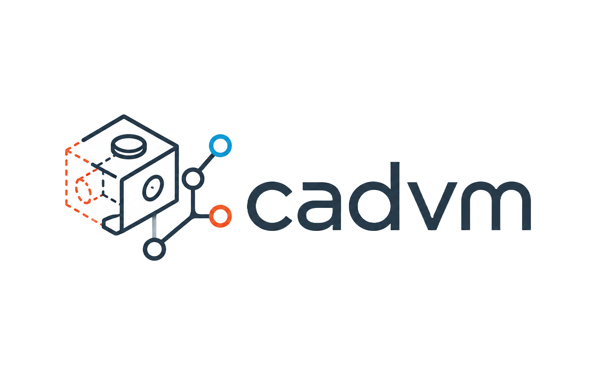

<p align="center">
  
</p>

<p align="center">
  <a href="https://github.com/AdeMBCH/cadvm/actions/workflows/ci.yml"></a>
  <a href="https://adembch.github.io/cadvm/"></a>
  <a href="https://adembch.github.io/cadvm/api/cadvm_core/index.html"></a>
  <a href="LICENSE"></a>
</p>

# cadvm — CAD Version Manager

`cadvm` is a **local-first version manager for STEP/STP CAD files**. It brings
Git-like workflows — snapshots, branches, diff, checkout, revert — to CAD data,
with a content-addressed, deduplicated object store.

📖 **Documentation: <https://adembch.github.io/cadvm/>** ·
🧊 **[Live 3D demo](https://adembch.github.io/cadvm/demo.html)**

It goes further than text versioning: a **geometric diff** (added / removed /
common material) via Open CASCADE, a **self-contained 3D viewer**, and an
**interactive terminal dashboard**.

## Installation

cadvm installs in two layers. The first is all most users need.

**1. The `cadvm` binary** (version control + TUI) — runs on Linux, macOS and
Windows (verified in CI on all three).

*One-line install* (Linux / macOS, no Rust needed):

```bash
curl -fsSL https://raw.githubusercontent.com/AdeMBCH/cadvm/main/scripts/install-release.sh | sh
```

It downloads the matching prebuilt binary from the
[latest release](https://github.com/AdeMBCH/cadvm/releases/latest) into
`~/.local/bin` (override with `CADVM_INSTALL_DIR`). Windows users download
`cadvm-x86_64-pc-windows-msvc.exe` from the release page.

*Or build from source* (needs a recent stable Rust toolchain):

```bash
cargo install --path crates/cadvm-cli      # installs `cadvm` into ~/.cargo/bin
```

**2. Geometry features** (`cadvm geom-diff`, `cadvm view`) additionally need
**[Open CASCADE](https://dev.opencascade.org/)** — a prerequisite **you install
yourself**; cadvm does not bundle it. On Ubuntu/Debian:

```bash
sudo apt-get install -y libocct-foundation-dev libocct-modeling-data-dev \
    libocct-modeling-algorithms-dev libocct-data-exchange-dev cmake g++
cpp/build.sh                                # builds the cadvm-geom helper
export CADVM_GEOM_BIN="$PWD/cpp/cadvm-geom/build/cadvm-geom"
```

The version control and TUI work **without** Open CASCADE; only the geometry
features require it. For macOS/Windows OCCT setup, shell completions and more,
see the **[documentation](https://adembch.github.io/cadvm/)**.

**One-command install / uninstall** from a clone (Linux/macOS):

```bash
./scripts/install.sh      # builds & installs cadvm (+ the geometry helper if OCCT is present)
./scripts/uninstall.sh    # removes the binary and the geometry build (your repos are untouched)
```

## Features

- Snapshots, history, branches, switch, revert, checkout and gc for STEP/STP files.
- Content-addressed, deduplicated storage (BLAKE3 + 256 KiB chunks).
- Lightweight STEP metadata (schema, entity counts, top entity types).
- Geometric diff — added / removed / common volumes and a face-to-face diff (Open CASCADE).
- A self-contained 3D WebGL viewer of the diff (`cadvm view`).
- An interactive terminal dashboard (`cadvm ui`) and shell completions.

## Architecture

A Cargo workspace with three crates:

| Crate         | Responsibility                                                        |
|---------------|-----------------------------------------------------------------------|
| `cadvm-store` | Content-addressed storage: `ObjectId`, BLAKE3 hashing, blobs, chunks. |
| `cadvm-core`  | Repository logic: commits, manifests, refs, branches, status, diff.   |
| `cadvm-cli`   | The `cadvm` binary: argument parsing (clap) and terminal output.      |

## Interactive dashboard

`cadvm ui` opens a full-screen terminal dashboard (built with `ratatui`):

- a **source-control-style commit list** (graph marker, short hash, branch chips,
  `HEAD` badge, author, relative time) with a live-detail pane (files + STEP
  metadata) on the right;
- press **`m`** to anchor a commit, then **`d`** (metadata diff), **`g`**
  (geometric diff), or **`v`** (build & open the 3D viewer) compare *anchor →
  selected* — or *parent → selected* if no anchor is set;
- **`b`** switch branch, **`s`** status, **`?`** help, **`q`** quit.

Geometry actions (`g`, `v`) need the `cadvm-geom` helper (see
[Installation](#installation)).

## Commands

| Command                       | Description                                               |
|-------------------------------|-----------------------------------------------------------|
| `cadvm init`                  | Create a `.cadvm/` repository in the current directory.   |
| `cadvm snapshot -m "msg"`     | Record a snapshot (commit) of all tracked STEP/STP files. |
| `cadvm ui`                    | Interactive full-screen terminal dashboard.               |
| `cadvm status`                | Show new / modified / deleted files vs. HEAD.             |
| `cadvm log`                   | Show the commit history of HEAD.                          |
| `cadvm show [<rev>]`          | Show one commit's details and per-file metadata.          |
| `cadvm diff`                  | Diff `HEAD~1..HEAD`.                                       |
| `cadvm diff <rev_a> <rev_b>`  | Diff two revisions.                                       |
| `cadvm checkout <rev>`        | Restore the working tree to a revision (restore-like).    |
| `cadvm checkout <rev> -- <file>…` | Restore only the named files (nothing is deleted).    |
| `cadvm branch`                | List branches.                                            |
| `cadvm branch <name>`         | Create a branch at HEAD.                                  |
| `cadvm branch -d <name>`      | Delete a branch (not the current one).                    |
| `cadvm switch <name>`         | Switch branches, restoring their files.                   |
| `cadvm revert <rev>`          | Create a commit that restores HEAD's parent state.        |
| `cadvm gc [--dry-run\|--prune]` | Report (and optionally delete) unreferenced objects.    |
| `cadvm config [<key>] [<value>]` | Get / set / list config (e.g. `user.name`).            |
| `cadvm geom-diff <rev_a> <rev_b>` | Geometric diff of modified STEP files (needs `cadvm-geom`). |
| `cadvm view <rev_a> <rev_b>`   | Generate a standalone 3D HTML viewer of the diff (needs `cadvm-geom`). |

Tracked formats: **`.step`** and **`.stp`** only. Hidden directories and
the `.cadvm/` directory are skipped during scanning, as are paths matching
`.cadvmignore` (see below).

### `.cadvmignore`

An optional `.cadvmignore` at the repository root excludes files from tracking,
one pattern per line:

```text
# comments and blank lines are ignored
*.bak            # glob on the file name (* and ? supported)
build/           # a directory and everything beneath it
/secret/old.step # leading "/" anchors to the repo root; "/" => full-path match
```

### Revisions

The revision resolver accepts:

- `HEAD`, `HEAD~1`, `HEAD~2`, … (and `HEAD^`)
- a branch name
- a full 64-char hash (with or without the `blake3:` prefix)
- an unambiguous short-hash prefix (ambiguity is reported as an error)

### Author & config

Commits record an author. Configure it once per repository:

```bash
cadvm config user.name  "Your Name"
cadvm config user.email "you@example.com"
cadvm config            # list all settings
```

Resolution order when stamping a commit is **environment → config → fallback**:

- `CADVM_AUTHOR_NAME` / `CADVM_AUTHOR_EMAIL` override the config (handy in CI);
- otherwise `user.name` / `user.email` from `.cadvm/config.json` are used;
- if nothing is set, the author falls back to `unknown` (snapshots never block).

The author is shown by `cadvm log` and `cadvm show`. Legacy commits written
before authors existed read back fine (their author is simply absent).

### Geometric diff (C++/OCCT)

The metadata diff above never inspects geometry. Real CAD diffing lives in
`cpp/cadvm-geom`, a **standalone C++/Open CASCADE executable** the Rust core runs
as a subprocess (no FFI — OCCT stays fully isolated). It loads two STEP files,
computes the boolean decomposition of their solids, and reports volumes:

- `common`  — material in both (A ∩ B);
- `added`   — material in B not in A (B − A);
- `removed` — material in A not in B (A − B).

It also reports a **topological face-to-face diff**: faces of A and B are matched
by a coarse geometric signature (surface type + rounded area + centre of mass),
yielding counts of *common / added / removed* faces alongside the volumes.

It needs the `cadvm-geom` helper and Open CASCADE — see
[Installation](#installation) to build it. Then:

```bash
cadvm geom-diff HEAD~1 HEAD          # all modified STEP files
cadvm geom-diff HEAD~1 HEAD -- piece.step
```

For each modified file cadvm extracts both versions from the store to temp files,
runs the helper, and prints the volume deltas. The Rust workspace builds and
tests **without** OCCT; only `geom-diff`/`view` need the helper at runtime (they
print a clear hint if `cadvm-geom` is not found).

### 3D viewer

`cadvm view` turns the geometric diff into a **single self-contained HTML file**
with a hand-written WebGL renderer (no CDN, no server, fully offline). Each
**face** of the part is colored by how it changed — **grey = unchanged,
green = added, red = removed** — and each layer can be toggled; drag to rotate,
scroll to zoom.

```bash
cadvm view HEAD~1 HEAD                 # if exactly one STEP file changed
cadvm view HEAD~1 HEAD -- piece.step   # pick the file when several changed
cadvm view HEAD~1 HEAD --open          # also open it in the browser
cadvm view HEAD~1 HEAD -o diff.html    # choose the output path
```

Under the hood the `cadvm-geom mesh` subcommand classifies each face and
tessellates it (`BRepMesh_IncrementalMesh`), which the viewer embeds and draws.

### Working-tree safety

`checkout`, `switch` and `revert` refuse to clobber your work:

- a **dirty working tree** blocks `switch` and `revert` (use `--force`);
- `checkout` refuses to overwrite a **locally modified file** (use `--force`);
- **untracked files are never deleted**.

`checkout <rev>` is intentionally **restore-like**: it restores files but does
**not** move the current branch or HEAD. Use `switch` to move between branches.

## Complete example

```bash
cadvm init

# piece.step = cube with a Ø5 hole
cadvm snapshot -m "Cube avec trou Ø5"

# edit piece.step = cube with a Ø8 hole
cadvm snapshot -m "Passage trou Ø5 vers Ø8"

cadvm log
cadvm diff HEAD~1 HEAD

# Undo the last change (creates a Revert commit)
cadvm revert HEAD
cadvm log

# Branch off and continue independently
cadvm branch second-hole
cadvm switch second-hole

# edit piece.step = two Ø5 holes
cadvm snapshot -m "Ajout deuxième trou Ø5"

cadvm switch main
cadvm switch second-hole
```

## Storage layout

A repository lives in `.cadvm/`:

```text
.cadvm/
├── objects/
│   ├── chunks/       # fixed 256 KiB content chunks (file storage)
│   ├── blobs/        # whole-file blobs (optional; cleaned by gc)
│   ├── manifests/    # serialized snapshots
│   └── commits/      # serialized commits
├── refs/heads/<branch>   # each file holds the branch's tip commit id
├── HEAD                  # "ref: refs/heads/main" or a detached commit id
├── index.json            # size+mtime hash cache (speeds up status)
└── tmp/                  # scratch space for atomic writes
```

Objects are addressed by the BLAKE3 hash of their content and sharded by the
first two hex byte-pairs:

```text
.cadvm/objects/chunks/ab/cd/<full-hex>
```

### Deduplication

1. **Content identity:** each file has a `raw_hash` (BLAKE3 of the whole file).
   Identical files share the same identity, so status/diff comparisons are exact.
2. **Fixed-size chunking:** files are split into 256 KiB chunks, each stored
   content-addressed, so identical chunks are shared across files and versions.

File content is stored as chunks and `checkout` reconstructs each file by
concatenating them — there is no on-disk duplication. `cadvm gc --prune` removes
any unreferenced objects.

## STEP metadata (textual only)

cadvm does **not** parse geometry. It performs cheap text scanning to surface:

- line count;
- approximate `HEADER;` / `DATA;` section detection and line counts;
- `FILE_SCHEMA` extraction;
- entity count in the DATA section (`#N = TYPE(...)` definitions);
- the top 20 entity types by frequency.

## Development

```bash
cargo fmt
cargo test
cargo clippy --all-targets --all-features
```

Test fixtures live in [`tests/fixtures/`](tests/fixtures/).

### Documentation

- **User guide** (mdBook) — in [`docs/`](docs/):
  ```bash
  cargo install mdbook        # once
  mdbook serve docs --open    # live preview
  mdbook build docs           # static site → docs/book/
  ```
- **API / developer docs** (rustdoc):
  ```bash
  cargo doc --no-deps --workspace --open
  ```

## Limits

- The geometric diff reports **volumes** (added/removed/common) and a heuristic
  face-to-face classification; it does not yet do exact topological face
  correspondence.
- cadvm cannot merge two concurrent edits of the same STEP file.
- `geom-diff` and `view` need the `cadvm-geom` helper (Open CASCADE); the rest of
  cadvm works without it.

## Roadmap

- Exact topological face correspondence (not just volumetric / heuristic).
- A staging index and richer merge tooling.

## Contributing

Issues and PRs welcome — see [CONTRIBUTING.md](CONTRIBUTING.md) and the
[Developing guide](https://adembch.github.io/cadvm/developing.html).

## License

Released under the **Prosperity Public License 3.0.0** (see [`LICENSE`](LICENSE)):
free for **noncommercial** use, with a 30-day commercial trial. You may reuse and
modify cadvm as a base for noncommercial work; **reselling** it (or a derivative)
as a commercial product requires a commercial license. For commercial use beyond
the trial, contact the maintainer.
